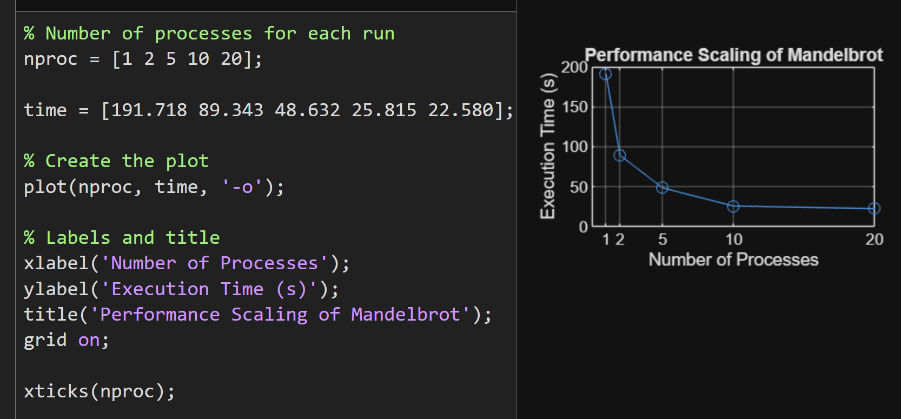

# System Programming Lab 11 Multiprocessing

## How to Build
### To compile using `make`:
```bash
make clean
```
```bash
make
```
### To compile manually:
Compile both:
```bash
gcc -o mandel mandel.c jpegrw.c -ljpeg -lm
```
```bash
gcc -o mandelmovie mandelmovie.c -lm
```

### Different Arg Options:
```bash
./mandelmovie -h
```
-n `<child>`  Number of processes (default=1)

-f `<frames>` Number of frames (default=50)

-m `<max>`   The maximum number of iterations per point. (default=1000)

-x `<coord>`  X coordinate of image center point. (default=0)

-y `<coord>`  Y coordinate of image center point. (default=0)

-s `<scale>`  Scale of the image in Mandlebrot coordinates (X-axis). (default=4)

-W `<pixels>` Width of the image in pixels. (default=1000)

-H `<pixels>` Height of the image in pixels. (default=1000)

-o `<file>`   Set output file. (default=mandel.bmp)

-h          Show this help text.
	
---

## Run Executable:
```bash
./mandelmovie -n 12
```
```bash
./mandelmovie -x -0.5 -y -0.5 -s 0.2
```
```bash
./mandelmovie -x -.38 -y -.665 -s .05 -m 100
```
```bash
./mandelmovie -x 0.286932 -y 0.014287 -s .0005 -m 1000
```

## My personal favorite:
```bash
./mandelmovie -x -.3678 -y .64988 -s .05 -m 6000 -n 12 -f 240
```
---

## a.) Overview of Implementation
My implementation creates a program called `mandelmovie`, which uses multiple child processes to generate 50 Mandelbrot images by default. The program accepts a command line option -n `<numProcesses>` to choose how many children run. -f `<frames>` changes the number of Mandelbrot images to process.


I used `getopt()` to parse the command line and `fork()` + `execv()` to launch the provided mandel program for each frame. Each child computes exactly one image and then exits. The parent process keeps track of active children, and when the maximum number of concurrent processes is reached, it waits for one to finish before launching the next frame. After all frames are started, the parent waits for all remaining children to complete.


This allows the system to compute frames in parallel and demonstrate multiprocessing speedup. Once the 50 images are generated, I used ffmpeg to create the movie:


***Used with VLC media player***
```bash
ffmpeg -framerate 50 -i mandel%d.jpg mandel.mpg
```
***Used with Windows media player***
```bash
ffmpeg -framerate 50 -i mandel%d.jpg -c:v libx264 -pix_fmt yuv420p mandel.mp4
```

---

## b.) Runtime Plot
| Header 1 | Header 2 |
| -------- | -------- |
|    01    |  191.718 |
|    02    |   89.343 |
|    05    |   48.632 |
|    10    |   25.815 |
|    20    |   22.580 |



---

## c.) Discussion of Results
The results show that increasing the number of child processes significantly reduces the runtime, especially when going from 1 to 10 processes. This demonstrates the benefits of multiprocessing, since each frame calculation is independent.

The speedup begins to flatten between 10 and 20 processes. This is expected because:

- The CPU has a limited number of cores, so additional processes begin competing for the same resources.

- The `mandel` program itself is CPU based

Multiprocessing provides strong speedup up to around 12 processes on my system, but additional processes beyond that point will result in smaller performance gains.

### To increase program preformance: 
- Go to your systems motherboard BIOS and overclock your CPU.
- If you're running on a laptop. An easy fix for Window 11 users Settings>System>Power & Battery>Powermode -> select best performance.