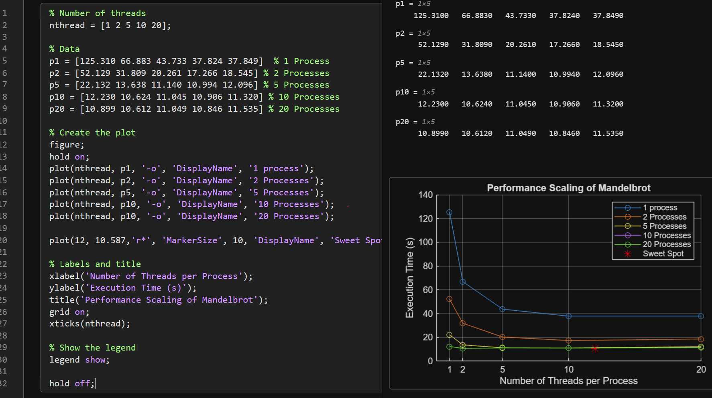

# System Programming Lab 11 Multiprocessing

## How to Build
### To compile using `make`:
```bash
make clean
```
```bash
make
```
### To compile manually:
Compile both:
```bash
gcc -o mandel mandel.c jpegrw.c -ljpeg -lm -lpthread
```
```bash
gcc -o mandelmovie mandelmovie.c -lm 
```
	
---

## Run Executable:
### Different Arg Options:
```bash
./mandelmovie -h
```
-n `<child>`  Number of processes (default=1)

-t `<thread>` Number of threads (defualt=1)

-f `<frames>` Number of frames (default=50)

-m `<max>`   The maximum number of iterations per point. (default=1000)

-x `<coord>`  X coordinate of image center point. (default=0)

-y `<coord>`  Y coordinate of image center point. (default=0)

-s `<scale>`  Scale of the image in Mandlebrot coordinates (X-axis). (default=4)

-W `<pixels>` Width of the image in pixels. (default=1000)

-H `<pixels>` Height of the image in pixels. (default=1000)

-o `<file>`   Set output file. (default=mandel.bmp)

-h          Show this help text.

```bash
./mandelmovie -n 12 -t 14
```
```bash
./mandelmovie -x -0.5 -y -0.5 -s 0.2
```
```bash
./mandelmovie -x -.38 -y -.665 -s .05 -m 100
```
```bash
./mandelmovie -x 0.286932 -y 0.014287 -s .0005 -m 1000
```

## My personal favorite:
```bash
./mandelmovie -x -.3678 -y .64988 -s .05 -m 6000 -n 12 -t 14 -f 240
```
---

## a.) Overview of Implementation
My implementation creates a program called `mandelmovie`, which uses mutiprocessing and multithreading to generate 50 Mandelbrot images by default. 

1.) Mulitprocessing (mandelmovie.c) uses `getopt()` to parse the command line and `fork()` + `execv()` to launch the provided mandel program for each frame. Each child computes exactly one image and then exits. The parent process keeps track of active children, and when the maximum number of concurrent processes is reached, it waits for one to finish before launching the next frame. After all frames are started, the parent waits for all remaining children to complete. -n `<numProcesses>` changes the number of processes it uses.

2.) Multithreading (mandel.c) inside each process `pthreads` are used to parallelize the pixel calculations. The image splits into horizontal regions based on the -t `<numThreads>`. Each thread calculates it region independently and main joins thre threads before writing the final image.


This allows the system to compute frames in parallel (multiprocessing) and compute individual images faster (multithreading). Once the 50 images are generated, I used ffmpeg to create the movie:


***Used with VLC media player***
```bash
ffmpeg -framerate 50 -i mandel%d.jpg mandel.mpg
```
***Used with Windows media player***
```bash
ffmpeg -framerate 50 -i mandel%d.jpg -c:v libx264 -pix_fmt yuv420p mandel.mp4
```

---

## b.) Runtime Plot
### Just Multiprocessing no threads of 240 frames
| #Process |  Time(s) |
| -------- | -------- |
|    01    |  191.718 |
|    02    |   89.343 |
|    05    |   48.632 |
|    10    |   25.815 |
|    20    |   22.580 |


---

### Multiprocessing and Multithreading of 240 frames
|  #Process  | 1 Threads  | 2 Threads  | 5 Threads  | 10 Threads | 20 Threads |
| ---------- | ---------- | ---------- |----------- | ---------- | ---------- |
|     01     |   125.310s |    66.883s |    43.733s |    37.824s |    37.849s |
|     02     |    52.129s |    31.809s |    20.261s |    17.266s |    18.545s |
|     05     |    22.132s |    13.638s |    11.140s |    10.994s |    12.096s |
|     10     |    12.230s |    10.624s |    11.045s |    10.906s |    11.320s |
|     20     |    10.899s |    10.612s |    11.049s |    10.846s |    11.535s |

### Sweet Spot
12 Processes & 2 Threads  |  10.587s


***The Sweetspot*** 

- I found a sweet spot for me is 12 processes and 2 threads at 10.587s. At high process counts (e.g., 20), increasing threads from 2 to 20 actually worsened performance.



---

## c.) Discussion of Results
Just ***Multiprocessing*** the results show that increasing the number of child processes significantly reduces the runtime, especially when going from 1 to 10 processes. This demonstrates the benefits of multiprocessing, since each frame calculation is independent.

The speedup begins to flatten between 10 and 20 processes. This is expected because:

- The CPU has a limited number of cores, so additional processes begin competing for the same resources.

- The `mandel` program itself is CPU based


***Multiprocessing and Multithreading*** Multiprocessing provides strong speedup up to around 12 processes on my system, but additional processes beyond that point will result in smaller performance gains. While threads are lighter weight, they share the same memory space. As the number of threads increases, they may contend for memory bandwidth. If the number of total threads (Processes × Threads) exceeds the number of physical CPU cores, the OS must perform "context switching," swapping threads in and out rapidly.This overhead eventually negates the benefit of adding more threads. However, from my data using both is benificial to get faster times than just mulitprocessing.


### To increase program preformance: 
- Go to your systems motherboard BIOS and overclock your CPU.
- If you're running on a laptop. An easy fix for Window 11 users Settings>System>Power & Battery>Powermode -> select best performance.